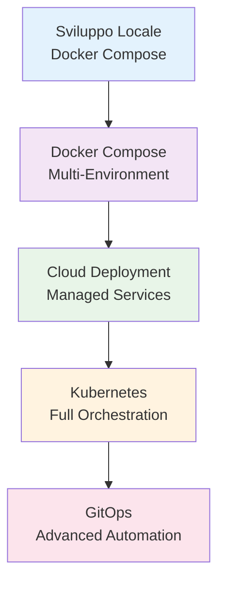

# Guida Tecnica: Configurazione Ambienti Multi-Stage per AI-PlayGround

## 📋 Indice
1. [Panoramica Architetturale](#panoramica-architetturale)
2. [Strategia degli Ambienti](#strategia-degli-ambienti)
3. [Opzioni di Deployment](#opzioni-di-deployment)
4. [Configurazione Docker Compose per Multi-Environment](#configurazione-docker-compose-per-multi-environment)
5. [Orchestrazione con Kubernetes](#orchestrazione-con-kubernetes)
6. [CI/CD Pipeline](#cicd-pipeline)
7. [Gestione Secrets e Configurazioni](#gestione-secrets-e-configurazioni)
8. [Monitoraggio e Logging](#monitoraggio-e-logging)
9. [Backup e Disaster Recovery](#backup-e-disaster-recovery)
10. [Raccomandazioni Finali](#raccomandazioni-finali)

---

## 🏗️ Panoramica Architetturale

### Architettura Attuale
Il progetto AI-PlayGround è strutturato come una **architettura a microservizi** con i seguenti componenti:

- **Frontend**: React.js (porta 3000)
- **API Gateway**: NGINX reverse proxy (porta 8080)
- **Microservizi Backend** (10 servizi):
  - Auth Service (porta 8000)
  - User Service (porta 8000)
  - Chatbot Service (porta 8001)
  - Image Generator Service (porta 8002)
  - Resource Manager Service (porta 8003)
  - Image Classifier Service (porta 8004)
  - Data Analysis Service (porta 8005)
  - RAG Service (porta 8006)
  - Learning Service (porta 8007)
- **Worker Services**: 4 worker Celery per task asincroni
- **Infrastructure**:
  - 9 database PostgreSQL dedicati
  - RabbitMQ per message queuing
  - Volume storage per media e dati

---

## 🎯 Strategia degli Ambienti

### Development Environment (DEV)
**Scopo**: Sviluppo locale e testing rapido
- **Infrastruttura**: Docker Compose locale
- **Database**: PostgreSQL containerizzato con dati di test
- **Secrets**: File locali non versionati
- **Monitoring**: Log semplici su console
- **Performance**: Configurazioni base per rapidità

### Staging Environment (STAGE)
**Scopo**: Test di integrazione e UAT (User Acceptance Testing)
- **Infrastruttura**: Cloud provider o server dedicato
- **Database**: PostgreSQL gestito o containerizzato con backup
- **Secrets**: Gestione centralizzata (HashiCorp Vault, AWS Secrets Manager)
- **Monitoring**: Log strutturati + metriche base
- **Performance**: Configurazioni simili alla produzione

### Production Environment (PROD)
**Scopo**: Ambiente live per utenti finali
- **Infrastruttura**: Kubernetes cluster o cloud container service
- **Database**: PostgreSQL gestito con alta disponibilità
- **Secrets**: Gestione enterprise-grade
- **Monitoring**: Monitoraggio completo, alerting, observability
- **Performance**: Ottimizzazioni complete, scaling automatico

---

## 🚀 Opzioni di Deployment

### Opzione 1: Docker Compose Multi-Environment (Semplice)

**Pro**: 
- Setup rapido
- Costi contenuti
- Gestione semplificata

**Contro**: 
- Scalabilità limitata
- Gestione manuale degli aggiornamenti
- Meno resilienza

**Adatto per**: Startup, progetti piccoli/medi, budget limitato

### Opzione 2: Kubernetes (Scalabile)

**Pro**: 
- Scalabilità automatica
- Alta disponibilità
- Gestione avanzata dei workload
- Ecosystem ricco di strumenti

**Contro**: 
- Complessità maggiore
- Curva di apprendimento ripida
- Costi operativi più alti

**Adatto per**: Progetti enterprise, alta scalabilità, team DevOps esperti

### Opzione 3: Cloud Managed Services (Hybrid)

**Pro**: 
- Gestione infrastrutturale ridotta
- Servizi gestiti (database, messaging)
- Integrazione nativa cloud

**Contro**: 
- Vendor lock-in
- Costi potenzialmente più alti
- Meno controllo granulare

**Adatto per**: Bilanciamento tra semplicità e funzionalità

---

## 🐳 Configurazione Docker Compose per Multi-Environment

### Struttura File Consigliata

```
├── docker-compose.yml                 # Base configuration
├── docker-compose.dev.yml            # Development overrides
├── docker-compose.staging.yml        # Staging overrides
├── docker-compose.prod.yml           # Production overrides
├── .env.dev                          # Development environment variables
├── .env.staging                      # Staging environment variables
├── .env.prod                         # Production environment variables
└── .secrets/
    ├── dev/                          # Development secrets
    ├── staging/                      # Staging secrets
    └── prod/                         # Production secrets
```

### docker-compose.base.yml
File base condiviso tra tutti gli ambienti con la definizione dei servizi core.

### docker-compose.dev.yml
Override per l'ambiente di sviluppo:
- Volume mounts per live reload
- Debug mode attivato
- Port exposure per debugging
- Database con dati di test

### docker-compose.staging.yml
Override per l'ambiente di staging:
- Configurazioni simili alla produzione
- Database dedicato
- Logging strutturato
- Health checks rafforzati

### docker-compose.prod.yml
Override per l'ambiente di produzione:
- Configurazioni ottimizzate
- Resource limits
- Security hardening
- Monitoring completo

### Comandi di Gestione

```bash
# Development
docker-compose -f docker-compose.yml -f docker-compose.dev.yml --env-file .env.dev up

# Staging
docker-compose -f docker-compose.yml -f docker-compose.staging.yml --env-file .env.staging up

# Production
docker-compose -f docker-compose.yml -f docker-compose.prod.yml --env-file .env.prod up
```

---

## ☸️ Orchestrazione con Kubernetes

### Namespace Strategy
```yaml
# Creazione namespace per ogni ambiente
apiVersion: v1
kind: Namespace
metadata:
  name: ai-playground-dev
---
apiVersion: v1
kind: Namespace
metadata:
  name: ai-playground-staging
---
apiVersion: v1
kind: Namespace
metadata:
  name: ai-playground-prod
```

### Struttura Manifesti Kubernetes

```
k8s/
├── base/                          # Configurazioni base
│   ├── auth-service/
│   ├── chatbot-service/
│   ├── data-analysis-service/
│   └── ...
├── overlays/
│   ├── dev/                       # Customizzazioni dev
│   ├── staging/                   # Customizzazioni staging
│   └── prod/                      # Customizzazioni prod
└── infrastructure/
    ├── postgres/
    ├── rabbitmq/
    ├── nginx/
    └── monitoring/
```

### Gestione con Kustomize
Utilizzo di Kustomize per la gestione delle configurazioni multi-ambiente:

```yaml
# kustomization.yaml per prod
apiVersion: kustomize.config.k8s.io/v1beta1
kind: Kustomization

namespace: ai-playground-prod

resources:
  - ../../base

patches:
  - target:
      kind: Deployment
      name: auth-service
    patch: |-
      - op: replace
        path: /spec/replicas
        value: 3
```

### Deployment Commands

```bash
# Development
kubectl apply -k k8s/overlays/dev

# Staging
kubectl apply -k k8s/overlays/staging

# Production
kubectl apply -k k8s/overlays/prod
```

---

## 🔄 CI/CD Pipeline

### Strategia GitOps

```mermaid
graph LR
    A[Code Push] --> B[Build & Test]
    B --> C[Build Images]
    C --> D[Push to Registry]
    D --> E[Deploy to DEV]
    E --> F[Integration Tests]
    F --> G[Deploy to STAGING]
    G --> H[UAT]
    H --> I[Deploy to PROD]
    I --> J[Health Checks]
    
    classDef build fill:#e3f2fd
    classDef test fill:#f3e5f5
    classDef deploy fill:#e8f5e8
    
    class B,C,D build
    class F,H,J test
    class E,G,I deploy
```



### GitHub Actions Pipeline

```yaml
# .github/workflows/deploy.yml
name: Deploy AI-PlayGround

on:
  push:
    branches: [main, develop, staging]

jobs:
  build:
    runs-on: ubuntu-latest
    steps:
      - uses: actions/checkout@v3
      - name: Build and Push Images
        run: |
          # Build logic here
          
  deploy-dev:
    if: github.ref == 'refs/heads/develop'
    needs: build
    runs-on: ubuntu-latest
    steps:
      - name: Deploy to Development
        run: |
          # Dev deployment logic
          
  deploy-staging:
    if: github.ref == 'refs/heads/staging'
    needs: build
    runs-on: ubuntu-latest
    steps:
      - name: Deploy to Staging
        run: |
          # Staging deployment logic
          
  deploy-prod:
    if: github.ref == 'refs/heads/main'
    needs: build
    runs-on: ubuntu-latest
    environment: production
    steps:
      - name: Deploy to Production
        run: |
          # Production deployment logic
```

---

## 🔐 Gestione Secrets e Configurazioni

### Opzione 1: HashiCorp Vault
**Raccomandato per ambienti enterprise**

```yaml
# vault-config.hcl
storage "consul" {
  address = "consul:8500"
  path    = "vault/"
}

listener "tcp" {
  address = "0.0.0.0:8200"
  tls_disable = false
  tls_cert_file = "/vault/certs/vault.crt"
  tls_key_file = "/vault/certs/vault.key"
}

ui = true
```

### Opzione 2: Cloud Provider Secrets
- **AWS**: AWS Secrets Manager + Parameter Store
- **Azure**: Azure Key Vault
- **GCP**: Google Secret Manager

### Opzione 3: Kubernetes Secrets
```yaml
apiVersion: v1
kind: Secret
metadata:
  name: api-keys
  namespace: ai-playground-prod
type: Opaque
data:
  openai-api-key: <base64-encoded-key>
  anthropic-api-key: <base64-encoded-key>
```

---

## 📊 Monitoraggio e Logging

### Stack di Monitoring Consigliato

#### Observability Stack
- **Metrics**: Prometheus + Grafana
- **Logging**: ELK Stack (Elasticsearch, Logstash, Kibana) o Loki
- **Tracing**: Jaeger o Zipkin
- **Alerting**: Prometheus Alertmanager + Slack/Email

#### Configurazione Grafana Dashboard

```yaml
# grafana-dashboard.json
{
  "dashboard": {
    "title": "AI-PlayGround Monitoring",
    "panels": [
      {
        "title": "Service Health",
        "type": "stat",
        "targets": [
          {
            "expr": "up{job=\"ai-playground\"}"
          }
        ]
      },
      {
        "title": "Request Rate",
        "type": "graph",
        "targets": [
          {
            "expr": "rate(http_requests_total[5m])"
          }
        ]
      }
    ]
  }
}
```

#### Log Aggregation

```yaml
# logstash.conf
input {
  beats {
    port => 5044
  }
}

filter {
  if [fields][service] == "ai-playground" {
    grok {
      match => { "message" => "%{TIMESTAMP_ISO8601:timestamp} %{LOGLEVEL:level} %{GREEDYDATA:message}" }
    }
  }
}

output {
  elasticsearch {
    hosts => ["elasticsearch:9200"]
    index => "ai-playground-%{+YYYY.MM.dd}"
  }
}
```

---

## 💾 Backup e Disaster Recovery

### Strategia di Backup

#### Database Backup
```bash
# Script di backup automatico
#!/bin/bash
TIMESTAMP=$(date +%Y%m%d_%H%M%S)
BACKUP_DIR="/backups"

# Backup di tutti i database PostgreSQL
services=("auth" "user" "chatbot" "image_generator" "resource" "classifier" "analysis" "rag" "learning")

for service in "${services[@]}"; do
    pg_dump -h ${service}_db -U ${service}_user ${service}_db > ${BACKUP_DIR}/${service}_db_${TIMESTAMP}.sql
    
    # Comprimi e carica su cloud storage
    gzip ${BACKUP_DIR}/${service}_db_${TIMESTAMP}.sql
    aws s3 cp ${BACKUP_DIR}/${service}_db_${TIMESTAMP}.sql.gz s3://ai-playground-backups/
done
```

#### Volume Backup
```yaml
# Backup Kubernetes volumes
apiVersion: batch/v1
kind: CronJob
metadata:
  name: volume-backup
spec:
  schedule: "0 2 * * *"  # Daily at 2 AM
  jobTemplate:
    spec:
      template:
        spec:
          containers:
          - name: backup
            image: backup-tool:latest
            command:
            - /bin/sh
            - -c
            - |
              # Backup logic for persistent volumes
              rsync -av /data/ /backup/$(date +%Y%m%d)/
```

### Recovery Plan
1. **RTO (Recovery Time Objective)**: < 1 ora
2. **RPO (Recovery Point Objective)**: < 4 ore
3. **Procedura di ripristino documentata**
4. **Test di disaster recovery mensili**

---

## 🏆 Raccomandazioni Finali

### Per Team Piccoli/Medi (< 10 sviluppatori)
1. **Iniziare con Docker Compose multi-environment**
2. **Utilizzare cloud managed databases**
3. **Implementare CI/CD semplice con GitHub Actions**
4. **Monitoring base con Grafana Cloud**

### Per Team Enterprise (> 10 sviluppatori)
1. **Migrare a Kubernetes con Helm charts**
2. **Implementare GitOps con ArgoCD**
3. **Vault per gestione secrets**
4. **Monitoring completo con Prometheus stack**

### Migration Path Consigliato



### Timeline Stimato
- **Fase 1 → 2**: 1-2 settimane
- **Fase 2 → 3**: 2-4 settimane
- **Fase 3 → 4**: 4-8 settimane
- **Fase 4 → 5**: 2-4 settimane

### Budget Indicativo (mensile)

| Ambiente | Docker Compose | Cloud Managed | Kubernetes |
|----------|---------------|---------------|------------|
| DEV      | €0-50         | €100-200      | €200-300   |
| STAGING  | €50-100       | €200-400      | €300-500   |
| PROD     | €100-300      | €500-1000     | €800-1500  |

---

## 📞 Next Steps

1. **Valutare le opzioni** in base a budget e competenze team
2. **Iniziare con Docker Compose multi-environment** per validare l'approccio
3. **Pianificare migrazione graduale** verso soluzione target
4. **Implementare monitoring** fin da subito
5. **Documentare procedure** di deployment e recovery

---

*Documento creato per il progetto AI-PlayGround - Fondazione Golinelli*
*Versione 1.0 - Dicembre 2024* 